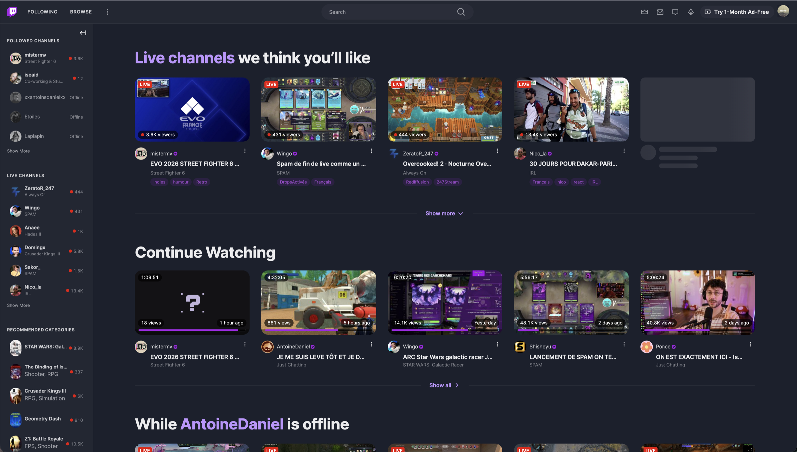
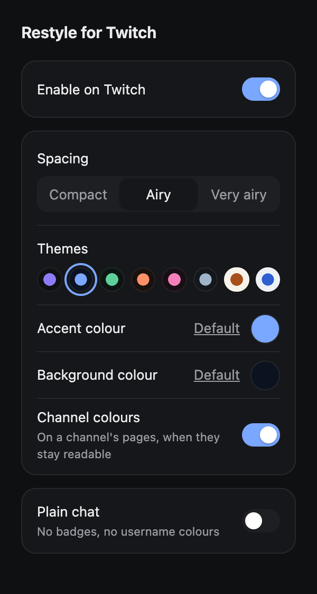

<p align="center">
  
</p>

<h1 align="center">Restyle for Twitch</h1>

<p align="center">A calmer, more coherent interface for twitch.tv, as a Chrome extension.</p>



Restyle for Twitch is a stylesheet layered over twitch.tv. It does not add
features or change how Twitch works: it quiets the noisy parts, gives the
content more room, and makes the pages look like they belong to the same site.

It is an unofficial project, not affiliated with or endorsed by Twitch.

## What it changes

- **Sidebar**: smaller, quieter rows, small-caps section headers, viewer counts
  aligned to the right. Stories, hover cards and the "For You" header are gone.
- **Top bar**: more breathing room, a pill-shaped search field, dimmed icons.
- **Home, Following and Browse**: no autoplaying carousel, large shelf titles,
  rounded thumbnails, and cards that put the streamer's name first. Tags become
  small accent-coloured chips.
- **Channel page**: a rounded, inset player and a centred column for the stream
  information and panels.
- **Chat**: muted messages that return to full contrast on hover, a fade at the
  top, and no leaderboard above it. Its popups (emotes, cheers, rewards, drops,
  chat identity) share one framed style.
- **Themes**: eight ready-made colour pairs, or the colours of the channel you
  are watching.
- **Menus and dialogs**: flat surfaces with a border instead of shadows, and a
  dimmed backdrop behind dialogs.

Creator Dashboard (`dashboard.twitch.tv`) is left untouched.

## Settings

Click the extension's icon to open its settings. Changes apply immediately,
without reloading the page.

| Setting | What it does |
| --- | --- |
| Enable on Twitch | Turns the whole restyle on or off. |
| Spacing | Three densities: compact, airy, very airy. |
| Themes | Eight ready-made pairs of background and accent colours, dark and light. |
| Accent colour | The colour of links, tags and highlights. |
| Plain chat | Hides chat badges and shows every username in the text colour. |
| Background colour | The page colour. Sidebars, chat, menus and text colours are derived from it. Reset to follow Twitch's own light or dark theme. |
| Channel colours | On a channel's pages, takes the accent and a tinted background from the channel's own colour, adjusted until text stays readable. Channels without a colour, or with a grey one, keep your settings. |



The settings popup is in English or French, following the browser's language.

## Install

The extension is not on the Chrome Web Store yet. To install it from source:

1. Download or clone this repository.
2. Open `chrome://extensions` and turn on **Developer mode**.
3. Click **Load unpacked** and select the repository folder.

It needs Chrome 120 or later, and should work in other Chromium browsers of
the same generation.

## Privacy

The extension only runs on `twitch.tv`. It collects nothing and sends nothing
anywhere. Its one permission, `storage`, is used to remember your settings.

## Development

There is no build step. The extension is made of:

| Path | Role |
| --- | --- |
| `src/tokens.css` | Design tokens: spacing, radii, type scale, palette. |
| `src/twitch.css` | The rules that map Twitch's interface onto those tokens. |
| `src/content.js` | Applies the settings and pauses the hidden carousel's video. |
| `popup/` | The settings popup. |
| `src/dev-reload.js` | Live reload, for unpacked installs only. |

When loaded unpacked, the extension reloads itself and any open Twitch tab
whenever a CSS or JavaScript file changes.

To build the Chrome Web Store package, which leaves the live reload out:

```sh
./scripts/package.sh
```

The zip is written to `dist/`. This script needs Node.js.

## Known limits

Twitch's markup has few stable hooks and changes without notice, so a Twitch
update can break part of the restyle. If something looks wrong, please open an
issue with a screenshot and the page's address.

Some rules match English labels, so a few details may be missing when Twitch is
displayed in another language.
